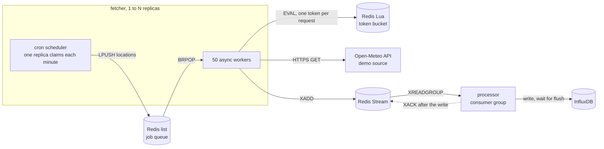
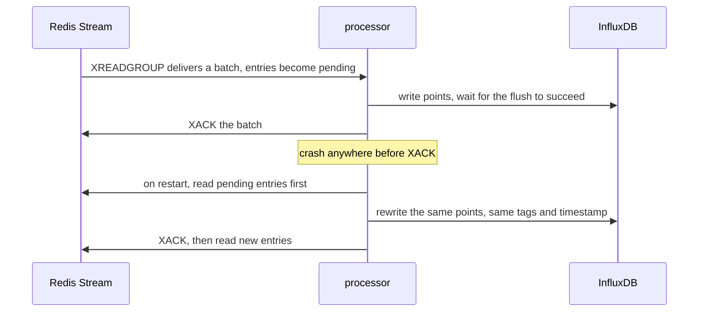

# stream-ingest-pipeline

Crash-safe streaming ingestion in TypeScript. Fifty async workers per replica share one atomic Redis rate limit, Redis Streams consumer groups carry every record, and InfluxDB writes are idempotent so a replay never duplicates data.

[](services)
[](LICENSE)
[](https://github.com/CodeMongerrr/stream-ingest-pipeline/releases)
[](https://github.com/CodeMongerrr/stream-ingest-pipeline/actions/workflows/ci.yml)
[](docker-compose.yml)
[](k8s)

The demo source is the free [Open-Meteo](https://open-meteo.com) API, polled for current conditions at a fixed list of coordinates. Weather is only the payload. The pipeline is the point, and the fetcher is the one piece you would swap to ingest something else.

## Why it exists

Polling a rate-limited API from many workers looks easy until three things go wrong at once.

1. **One quota, many callers.** The upstream limit applies to the whole client, not to each worker. A limiter that lives inside one process is wrong the moment you run a second replica, because every replica believes it owns the full budget.
2. **Crashes in the middle of a batch.** A consumer that dies after reading but before writing loses data, and one that dies after writing but before recording progress writes it twice.
3. **Duplicates are the price of safety.** At-least-once delivery means replays will happen, so the store has to absorb them without growing duplicate rows.

This repo solves each one with a small, explicit mechanism you can read in a few hundred lines.

## Architecture



| Component | Role |
| --- | --- |
| `services/fetcher` | Cron scheduler, 50 async workers, the shared rate limiter, and an Express server for `/metrics` and `/healthz` |
| `services/processor` | Reads the stream through a consumer group, writes to InfluxDB, acknowledges only after the write |
| Redis 7 | Job queue (list), message broker (stream) and rate limiter state, all in one dependency |
| InfluxDB 2.7 | Time series store with a 30 day retention bucket |
| `k8s/` | Deployments and Services for all four pieces, plus a ConfigMap and a Secret |

## How it works

### One rate limit shared by every worker on every replica

Every request first takes a token from a single token bucket stored in Redis. The refill and the take happen inside one Lua script, and Redis runs scripts atomically, so two workers can never spend the same token no matter how many processes or hosts they run on.

```lua
local data        = redis.call("HMGET", key, "tokens", "last_refill")
local tokens      = tonumber(data[1]) or capacity
local last_refill = tonumber(data[2]) or now

local elapsed    = math.max(0, now - last_refill)
local new_tokens = math.min(capacity, tokens + elapsed * refill_rate)

if new_tokens >= 1 then
  new_tokens = new_tokens - 1
  redis.call("HMSET", key, "tokens", new_tokens, "last_refill", now)
  redis.call("EXPIRE", key, 60)
  return 1
```

The bucket refills at 8 tokens per second with a capacity of 8. A denied worker sleeps 40 ms and asks again. If a 429 still gets through after the HTTP client's own retries, the worker sets a cooldown key with `SET NX EX 30`, and every worker on every replica reads its `PTTL` and sleeps exactly that long before asking for tokens again.

With two fetcher replicas running 100 workers between them, the combined request rate stays at the single 8 per second budget, because both replicas draw from the same bucket.

### Scheduling a cycle

Once a minute the scheduler replaces the job queue with the location list. Every replica runs the same cron, and the first one to claim the current minute with `SET NX` enqueues the cycle while the rest skip it. Jobs left over from the previous minute are dropped when the queue is replaced, so the pipeline always works on the latest cycle instead of building a backlog.

Workers pop jobs with `BRPOP` on a dedicated Redis connection. A blocking pop holds its connection until it returns, so keeping it separate means the scheduler, the limiter and `XADD` never wait behind an empty queue.

### Consumer groups and crash recovery

The processor reads with `XREADGROUP` as a named consumer in the group `processor-group`. Redis remembers every entry it has delivered but not yet seen acknowledged, in the consumer's pending list.



1. On start the processor reads its own pending entries first, then switches to new ones.
2. Each batch is written to InfluxDB and the processor waits for the write to be accepted before it sends `XACK`.
3. If the write fails, nothing is acknowledged. The processor backs off for a second and replays its pending list, so an InfluxDB outage pauses the pipeline instead of dropping data.
4. The group is created from the start of the stream, so entries written before the processor first comes up are delivered too.

### Idempotent writes

A point in InfluxDB is identified by its measurement, its tag set and its timestamp. The timestamp is the observation time reported by the source, not the time the processor saw the message. Replaying a message therefore overwrites the same point with the same values, and at-least-once delivery ends up as exactly one row per observation.

Open-Meteo refreshes current conditions every 15 minutes, so repeated polls inside the same window also land on the same point instead of adding rows.

## Quickstart

Requires Docker with Compose v2.

```bash
git clone https://github.com/CodeMongerrr/stream-ingest-pipeline
cd stream-ingest-pipeline

# live data from Open-Meteo
docker compose up --build -d

# or synthetic data that uses no API quota
USE_MOCK=true docker compose up --build -d
```

Check that it is running.

```bash
curl localhost:3001/healthz
curl -s localhost:3001/metrics | grep '^weather_'
docker compose logs -f fetcher      # per-second rate, success count and latency
docker compose logs -f processor    # one line per record written
```

Open the InfluxDB UI at http://localhost:8086 and sign in with the development credentials set in `docker-compose.yml`. In Data Explorer, open the Script Editor and run a query.

```flux
from(bucket: "weather_bucket")
  |> range(start: -1h)
  |> filter(fn: (r) => r._measurement == "weather" and r._field == "temperature")
  |> group()
  |> count()
```

### See crash recovery yourself

```bash
docker kill -s KILL weather_processor                          # hard crash mid-stream
docker compose exec redis redis-cli XINFO GROUPS weather:raw    # lag grows while it is down
docker compose start processor                                 # replays pending first, then catches up
docker compose exec redis redis-cli XINFO GROUPS weather:raw    # pending and lag back near 0
```

Stop with `docker compose down`, or `docker compose down -v` to also wipe the Redis and InfluxDB volumes.

## Deploy to Kubernetes

The manifests expect locally built images named `pipeline-fetcher` and `pipeline-processor`. These steps use [kind](https://kind.sigs.k8s.io), and minikube works the same way with `minikube image load`.

```bash
docker build -t pipeline-fetcher:latest   services/fetcher
docker build -t pipeline-processor:latest services/processor

kind create cluster --name pipeline
kind load docker-image pipeline-fetcher:latest pipeline-processor:latest --name pipeline

# k8s/secret.yaml ships development values. Replace them before any shared cluster.
kubectl apply -f k8s/
kubectl rollout status deployment/processor

kubectl port-forward svc/fetcher-service 3000:3000
curl localhost:3000/metrics
```

To use synthetic data in the cluster, run `kubectl set env deployment/fetcher USE_MOCK=true`. To watch the shared limiter hold across replicas, run `kubectl scale deployment/fetcher --replicas=3` and compare the combined `weather_api_calls_total` rate with a single replica. Tear down with `kubectl delete -f k8s/` or `kind delete cluster --name pipeline`.

## Configuration

| Variable | Service | Default | Purpose |
| --- | --- | --- | --- |
| `REDIS_URL` | both | `redis://localhost:6379` | Redis connection for the queue, the stream and the limiter |
| `INFLUX_URL` | processor | `http://localhost:8086` | InfluxDB endpoint |
| `INFLUX_TOKEN` | processor | set in compose or the Secret | InfluxDB API token, never commit a real one |
| `INFLUX_ORG` | processor | `weather_org` | InfluxDB organisation |
| `INFLUX_BUCKET` | processor | `weather_bucket` | InfluxDB bucket |
| `USE_MOCK` | fetcher | `false` | `true` swaps the HTTP call for a local generator with realistic latency |
| `METRICS_PORT` | fetcher | `3000` | Port for `/metrics` and `/healthz` |
| `STREAM_MAXLEN` | fetcher | `100000` | Approximate cap on stream length, oldest entries are trimmed first |

Tuning constants live in code.

| Setting | Value | Where |
| --- | --- | --- |
| Workers per replica | 50 | `services/fetcher/src/worker.ts` |
| Rate limit and bucket capacity | 8 per second, 8 tokens | `services/fetcher/src/rate-limiter.ts` |
| Cooldown after a 429 | 30 s | `services/fetcher/src/rate-limiter.ts` |
| HTTP retries | 5, full jitter backoff capped at 32 s, honours `Retry-After` | `services/fetcher/src/fetcher.ts` |
| Cycle | every minute | `services/fetcher/src/scheduler.ts` |
| Locations per cycle | 500 of 1,214 | `services/fetcher/src/locations.ts` |
| Consumer batch and block time | 50 entries, 5 s | `services/processor/src/consumer.ts` |

The location list holds 1,214 coordinates, 248 named cities plus a 966 point grid at 8 degree spacing, and the demo enqueues the first 500 each minute.

## Observability

The fetcher serves Prometheus metrics at `/metrics`.

| Metric | Type | Meaning |
| --- | --- | --- |
| `weather_api_calls_total` | counter | Requests started against the source API |
| `weather_api_calls_success_total` | counter | Requests that returned data |
| `weather_api_calls_failed_total` | counter | Requests that failed after all retries |
| `weather_api_response_latency_seconds` | histogram | Request latency, buckets from 50 ms to 10 s |
| `weather_rate_limiter_denials_total` | counter | Token requests the shared bucket refused |

`/healthz` returns `200` with `{"status":"ok"}` when Open-Meteo answers, and `503` with `{"status":"degraded"}` when it does not. In mock mode it always returns `200`. It checks the upstream, not Redis, so it suits alerting better than a liveness probe.

The fetcher also prints a live line per second with requests, failures, timeouts and average and p99 latency for the current cycle.

## Design decisions and trade-offs

| Decision | Why | Cost |
| --- | --- | --- |
| Rate limiter as a Lua script in Redis | Correct across any number of replicas with one round trip per token | Denied workers poll every 40 ms, so the denial counter climbs fast and Redis sees steady traffic |
| Redis as queue, broker and limiter | One dependency to run and reason about | Redis is a single point of failure, and the Kubernetes manifests give it no persistent volume |
| At-least-once delivery with idempotent writes | Simple, and a crash costs a replay rather than a lost or duplicated row | Correctness depends on the point identity, so the timestamp must come from the source |
| Latest cycle wins | Fresh data and a queue that never grows without bound | Jobs not fetched before the next tick are dropped |
| Bounded stream | Redis memory stays flat | If the processor is down longer than the buffer, about three and a half hours at 8 per second, the oldest unread entries are trimmed |
| Single named consumer | Restarts replay their own pending list with no coordination | Running more than one processor replica needs per pod consumer names and reclaiming of idle entries |

## Limitations and roadmap

- **Throughput versus cycle length.** At 8 requests per second a pass over 500 locations takes about 63 seconds, a little longer than the one minute cycle, so the last few locations in the list are usually dropped when the next cycle replaces the queue. All 1,214 locations need about 152 seconds per pass, so covering them means a longer cycle, not only a bigger cap. Making the cap and the cron interval configurable is next.
- **Upstream quota.** Open-Meteo's free tier is for non-commercial use under 10,000 calls a day, and at 8 per second the live demo reaches that in about 21 minutes. Use mock mode for long runs.
- **Limiter clock.** Each replica passes its own clock into the script, so skew between hosts can skew refills. Reading `TIME` inside the script removes that.
- **Horizontal processors.** Planned with per pod consumer names and `XAUTOCLAIM` for entries left idle by a dead consumer.
- **Tag design.** `weather_condition` is a tag, so a changed condition at the same timestamp creates a second series. It belongs in a field.
- **Health and metrics.** `/healthz` spends a real upstream call each time it is hit, and the processor exposes no metrics yet.
- **State in Kubernetes.** Redis and InfluxDB run without persistent volumes, and `k8s/secret.yaml` holds development values.
- **Tests.** CI installs, typechecks and builds both services and their images. An automated crash test that kills the processor and diffs the stream against InfluxDB is planned.

## Project layout

```text
services/
  fetcher/     scheduler, worker pool, rate limiter, HTTP client, metrics server
  processor/   consumer group reader and InfluxDB writer
k8s/           Deployments, Services, ConfigMap, Secret
docker-compose.yml
```

## License

[MIT](LICENSE)

Built by [Aditya Joshi](https://github.com/CodeMongerrr) · [joshionchain.com](https://www.joshionchain.com)
